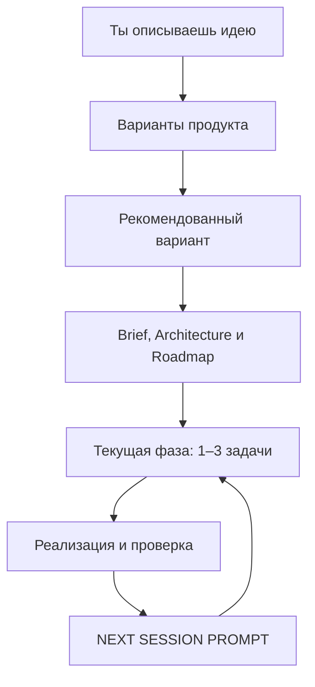

<div align="center">

# Token-Efficient Spec Kit

### Понятный workflow для разработки с AI-агентами — от идеи до проверенного результата

**Опиши результат. AI предложит продуктовый фокус, выберет технический путь, проведёт проект по фазам и в конце каждой сессии скажет, что делать дальше.**

`Идея → Варианты → Архитектура → Фазы → Код → Проверка → Следующий prompt`

**v0.8.2**

[English](README_EN.md) · [Подробное руководство](docs/USAGE_GUIDE.md) · [Workflow](docs/WORKFLOW.md) · [Maintenance](docs/MAINTENANCE.md) · [Changelog](CHANGELOG.md)

</div>

---

## Что это даёт

Token-Efficient Spec Kit — это workflow для repository-aware AI-агентов: Codex,
Claude Code, Cursor и совместимых инструментов. Он хранит решения в репозитории,
а не в памяти одного чата, поэтому новый AI-сеанс может продолжить работу без
повторного объяснения проекта.

Тебе не нужно заранее решать:

```text
Какой framework или database использовать?
Как разбить работу на этапы?
Что проверить перед релизом?
Какой prompt отправить AI следующим?
```

Ты отвечаешь за желаемый результат и реальные ограничения. AI отвечает за обычные
инженерные решения, план, реализацию, проверку и навигацию по проекту.

В типичной сессии AI:

- понимает пользователей, задачу и ограничения;
- задаёт вопрос только когда без ответа нельзя безопасно продолжить;
- выбирает один практичный stack и объясняет важные решения;
- делит работу на проверяемые фазы и берёт обычно 1–3 связанные задачи;
- запускает подходящие tests, review или QA и готовит следующий prompt.

---

# Старт нового проекта

## 1. Подготовь копию шаблона

```bash
git clone https://github.com/Elguajo/Token-Efficient-Spec-Kit.git my-project
cd my-project
rm -rf .git && git init
```

Последняя строка нужна только для свежей копии шаблона: она убирает связь с этим
репозиторием, чтобы случайно не отправить свой проект сюда. Если добавляешь
workflow в существующий repository, смотри [Usage Guide](docs/USAGE_GUIDE.md).

## 2. Открой папку в AI coding agent

Агент должен уметь читать и изменять файлы проекта.

## 3. Отправь одно сообщение с идеей

Не открывай файл и не заменяй плейсхолдеры. В чате с AI-agent отправь, например:

```text
Запусти prompts/START_NEW_PROJECT.md.
Хочу desktop-приложение для Windows и macOS, которое сортирует мои 3D-ассеты,
создаёт previews и позволяет искать их по тегам.
```

Достаточно описать желаемый результат. Не нужно заранее выбирать stack, framework,
database или хостинг.

## Что произойдёт дальше

1. AI обычно предложит три содержательно разные product-направления.
2. Он объяснит рекомендацию и продолжит с ней без отдельного выбора.
3. Он попросит тебя выбрать вариант, только если различаются бюджет, безопасность,
   compliance или другой необратимый product/business trade-off.
4. AI создаст `PROJECT_BRIEF.md`, `ARCHITECTURE.md`, `ROADMAP.md` и фазы, затем
   возьмёт первые 1–3 связанные задачи.
5. В конце сессии он проверит результат и вернёт готовый `NEXT SESSION PROMPT`.

```text
Твоя идея
→ Product Directions (normally 3)
→ Recommended Direction (default)
→ Project Brief
→ Architecture
→ Roadmap
→ Scoped Tooling Bootstrap
→ Current Phase
→ 1–3 задачи
→ Реализация и проверка
→ NEXT SESSION PROMPT
```



---

# Продолжение работы

После каждой meaningful coding/review session AI обязан обновить три связанных
вещи: marker текущей фазы в `docs/project/ROADMAP.md`,
`docs/project/NEXT_SESSION.md` и `NEXT SESSION PROMPT` в ответе.

В большинстве случаев просто скопируй последний prompt в новую сессию. Не нужно
самому решать, закончена ли фаза, пора ли запускать QA или какой этап открывать.

| Ситуация | Что отправить AI |
|---|---|
| Новый проект | Сообщение из шага 3 выше |
| Продолжить работу | Последний **NEXT SESSION PROMPT** |
| Не понимаю состояние проекта | [`PROJECT_DOCTOR.md`](prompts/PROJECT_DOCTOR.md) |
| Изменить требования | [`CHANGE_REQUEST.md`](prompts/CHANGE_REQUEST.md) |
| Исправить ошибку | [`BUG_FIX.md`](prompts/BUG_FIX.md) |
| Проверить и закрыть фазу | [`REVIEW_CURRENT_PHASE.md`](prompts/REVIEW_CURRENT_PHASE.md) |
| Потерял следующий шаг | [`GENERATE_NEXT_SESSION_PROMPT.md`](prompts/GENERATE_NEXT_SESSION_PROMPT.md) |
| Нужна глубокая formal-spec для сложной фазы | [`ENABLE_ADVANCED_SPEC_MODE.md`](prompts/ENABLE_ADVANCED_SPEC_MODE.md) |

---

# Для опытных пользователей: как экономится контекст

AI маршрутизирует инструменты, а не запускает всё подряд.

| Задача | Предпочтительный инструмент |
|---|---|
| «Где реализована логика X?» / незнакомая область кода | **Semble** |
| Известный symbol, references, diagnostics или безопасный rename | **Serena** |
| Маленькая правка в известном файле | native tools агента |
| Tests, build, git или шумный terminal output | **RTK** |

```text
Semble находит релевантную логику
→ broad discovery заканчивается
→ Serena подключается только для symbol-level задачи
→ RTK используется только для tool output
```

Одну и ту же область кода не нужно заново искать Semble, Serena и text search без
причины. Project Brief, Architecture, Roadmap и phase-файлы остаются долговременной
памятью проекта; инструменты не создают второй источник правды.

Полная модель, правила fallback и границы ownership — в
[End-to-End Workflow](docs/WORKFLOW.md) и [Integrations](integrations/README.md).

---

# Инструменты: что нужно знать пользователю

AI не должен заставлять тебя вручную настраивать обычные инструменты. Сначала он
понимает продукт и tier, затем подключает только полезное. Недоступный инструмент
не блокирует работу: агент использует безопасный fallback.

```text
Superpowers  → реализация, TDD и отладка
Semble       → найти логику по смыслу в незнакомом коде
Serena       → symbols, references и безопасный рефакторинг
RTK          → компактный terminal/test/build/git output
gstack       → review, browser QA и release checks
Context7     → свежая документация API и libraries
```

> Канонический профиль: [`integrations/PROFILES.md`](integrations/PROFILES.md).
> Superpowers и Context7 могут быть полезны сразу; остальные инструменты обычно
> подключаются после появления кода и подтверждённой необходимости.

AI сохраняет установленные, отложенные и пропущенные инструменты в
`docs/project/TOOLING_STATUS.md`. Твоё участие обычно нужно только для login/OAuth,
отсутствующего system runtime или глобальной настройки, которая затрагивает другие
проекты.

Если ты опытный пользователь, полная модель маршрутизации контекста описана в
[Workflow](docs/WORKFLOW.md), а правила интеграций — в
[Integrations](integrations/README.md). GitHub Spec Kit не является обязательным:
он включается только как [Advanced Spec Mode](integrations/SPEC_KIT.md) для сложных
фаз.

---

# Где искать подробности

| Нужно… | Открыть |
|---|---|
| Пошаговое руководство со всеми сценариями | [Usage Guide](docs/USAGE_GUIDE.md) |
| Понять внутреннюю модель workflow | [End-to-End Workflow](docs/WORKFLOW.md) |
| Посмотреть следующий шаг текущего проекта | [NEXT_SESSION.md](docs/project/NEXT_SESSION.md) |
| Настроить или понять интеграции | [Integrations](integrations/README.md) |
| Запустить doctor, self-audit или update | [Maintenance](docs/MAINTENANCE.md) |
| Посмотреть историю изменений | [Changelog](CHANGELOG.md) |

## Проверка целостности workflow

```bash
python3 tools/audit.py
```

Проверяет ссылки, версии, handoff, tooling profile и границы между framework и
проектом. Та же проверка запускается в CI.

<div align="center">

### Не обязательно знать, как это программировать. Достаточно ясно описать результат.

**[Начать новый проект →](prompts/START_NEW_PROJECT.md)**

MIT — см. [LICENSE](LICENSE) · Built with ♥ by [Elguajo](https://github.com/Elguajo)

</div>
