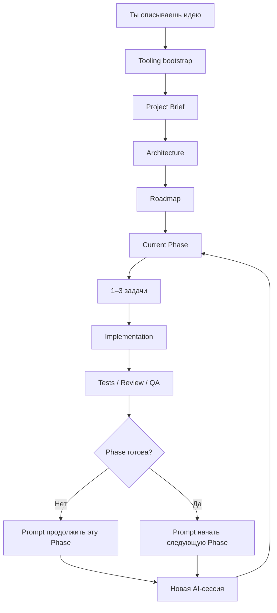

<div align="center">

# Token-Efficient Spec Kit

### Понятный workflow для разработки с AI-агентами — от идеи до готового проекта

**Ты объясняешь, что хочешь получить. AI сам выбирает технический путь, ведёт проект по фазам и в конце каждой сессии говорит, что делать дальше.**

`Идея → Архитектура → Фазы → 1–3 задачи → Код → Проверка → Следующий prompt`

**v0.6.0**

[English](README_EN.md) · [Подробное руководство](docs/USAGE_GUIDE.md) · [Workflow](docs/WORKFLOW.md) · [Maintenance](docs/MAINTENANCE.md) · [Changelog](CHANGELOG.md)

</div>

---

## Если ты впервые занимаешься vibe coding

Тебе **не нужно заранее понимать разработку** и выбирать:

```text
React или Vue?
PostgreSQL или MongoDB?
Vercel или AWS?
Какую архитектуру использовать?
На какие этапы разбить проект?
Что попросить у AI следующим сообщением?
```

Ты можешь начать обычной фразой:

```text
Хочу приложение, где дизайнеры смогут продавать digital assets.
```

Дальше Token-Efficient Spec Kit заставляет AI действовать как самостоятельный engineering-agent:

- понять продукт и пользователей;
- задать только действительно необходимые вопросы;
- выбрать один практичный stack;
- создать Architecture и Roadmap;
- разбить работу на небольшие phases;
- выполнять обычно по 1–3 связанные задачи за сессию;
- использовать только нужный code/context;
- запускать нужные tests / review / QA;
- определить правильный следующий шаг;
- выдать готовый prompt для новой сессии.

> **Ты управляешь продуктом. AI управляет инженерным исполнением и навигацией по проекту.**

---

# Начать проект — пошагово

## 1. Скопируй шаблон

```bash
git clone https://github.com/Elguajo/Token-Efficient-Spec-Kit.git my-project
cd my-project
```

Если у тебя уже есть проект, workflow можно добавить в существующий repository.

---

## 2. Открой папку проекта в AI coding agent

Например:

```text
Codex
Claude Code
Cursor
или другой repository-aware AI agent
```

Важно, чтобы AI мог читать и изменять файлы проекта.

---

## 3. Открой `START_NEW_PROJECT.md`

Файл:

```text
prompts/START_NEW_PROJECT.md
```

Найди:

```text
<WHAT_I_WANT>
```

и замени на свою идею.

Например:

```text
Хочу desktop-приложение для Windows и macOS,
которое сортирует мои 3D-ассеты,
создаёт previews и позволяет искать их по тегам.
```

Передай весь prompt своему AI-agent.

---

## 4. AI сам подготовит рабочее окружение

При первом запуске AI проверяет `docs/project/TOOLING_STATUS.md` и, если нужно, автоматически настраивает Recommended tooling:

```text
Superpowers  → как реализовывать и отлаживать
Semble       → находить только релевантные куски кода
RTK          → сокращать шум terminal/test/build output
gstack       → review / QA / release checks
Context7     → свежая документация API/libraries
```

Тебе не нужно отдельно устанавливать каждый инструмент вручную.

Если инструмент уже настроен — AI его не переустанавливает. Если Semble или RTK недоступны, проект **не блокируется**: AI продолжает обычными средствами.

Иногда потребуется твоё участие только для login/OAuth, отсутствующего system runtime или глобального hook/config изменения, которое затронет другие проекты.

---

## 5. AI создаст структуру проекта и начнёт первую фазу

После запуска AI самостоятельно создаёт и поддерживает:

```text
PROJECT_BRIEF.md   → что мы строим
ARCHITECTURE.md    → как это будет устроено
ROADMAP.md         → в каком порядке будем делать
phases/            → текущие этапы разработки
NEXT_SESSION.md    → что делать дальше
```

Он начнёт первую небольшую implementation-сессию, если нет настоящего блокера.

Обычный выбор framework, database или library не должен перекладываться на тебя.

---

## 6. В конце сессии просто скопируй следующий prompt

Каждая meaningful coding/review session должна заканчиваться блоком:

```text
NEXT SESSION PROMPT

<готовый prompt>
```

Дальше:

```text
AI закончил работу
↓
ты копируешь NEXT SESSION PROMPT
↓
открываешь новую AI-сессию
↓
вставляешь prompt
↓
AI продолжает с правильного места
```

Тебе не нужно самому решать, закончена ли phase, пора ли делать QA или какой этап открывать дальше.

Текущий handoff также хранится в:

```text
docs/project/NEXT_SESSION.md
```

Если следующий prompt потерялся — используй [`GENERATE_NEXT_SESSION_PROMPT.md`](prompts/GENERATE_NEXT_SESSION_PROMPT.md).

---

# Как выглядит весь процесс



Project knowledge хранится в repository, поэтому следующей сессии не нужно перечитывать всю историю чатов.

---

# Если ты уже опытный пользователь

Можно воспринимать Token-Efficient Spec Kit как компактный orchestration + context-routing layer:

```text
User Intent
→ Project Brief
→ Architecture
→ Roadmap
→ Current Phase
→ targeted code retrieval
→ 1–3 cohesive tasks
→ Implementation
→ compact verification output
→ Review / QA
→ Convergence
→ Session Handoff
```

Token-efficiency разделена по слоям:

```text
Project/docs context → Token-Efficient Spec Kit
Code retrieval       → Semble
Shell/tool output     → RTK
Fresh external docs  → Context7 on demand
```

Основные правила:

- **Token-Efficient Spec Kit — canonical core workflow**;
- одна рабочая сессия обычно = 1–3 связанные задачи;
- context загружается по необходимости, а не весь repository;
- один факт хранится в одном canonical месте;
- архитектурная сложность добавляется только при реальной необходимости;
- completion требует evidence, а не просто написанного кода;
- внешние tools усиливают workflow, но не создают второй roadmap или source of truth.

[Подробная техническая модель →](docs/WORKFLOW.md)

---

## Почему это экономит токены

Обычная implementation-сессия читает только нужный project context, а для codebase exploration при наличии Semble сначала получает релевантные chunks вместо широкого `grep → read full file` цикла.

RTK, когда безопасно поддерживается активным agent, сокращает verbose output тестов, git, build и других команд до decision-relevant информации.

> **Один факт — одно canonical место. Одна сессия — обычно 1–3 связанные задачи. Читай только то, что нужно сейчас.**

---

# Recommended AI Engineering Profile

Сам Token-Efficient Spec Kit работает самостоятельно как **CORE**.

Рекомендуемые дополнительные инструменты:

| Инструмент | Для чего |
|---|---|
| **Superpowers** | TDD, implementation discipline, systematic debugging |
| **Semble** | Token-efficient semantic/hybrid code retrieval |
| **RTK** | Сжатие terminal/test/build/git output |
| **gstack** | Engineering/design review, browser QA, release checks |
| **Context7** | Актуальная документация libraries/API по необходимости |

Они устанавливаются во время первого automatic tooling bootstrap, когда это безопасно для текущего coding harness.

GitHub Spec Kit **не обязателен**. Он используется как [Optional Advanced Spec Mode](integrations/SPEC_KIT.md) только для сложных фаз, где formal deep specification действительно улучшает результат.

[Подробнее об интеграциях →](integrations/README.md)

---

# Что использовать в разных ситуациях

| Что происходит | Что открыть |
|---|---|
| 🚀 Начинаю новый проект | [`START_NEW_PROJECT.md`](prompts/START_NEW_PROJECT.md) |
| ▶️ Продолжаю обычную работу | предыдущий **NEXT SESSION PROMPT** |
| ✅ Хочу проверить и закрыть phase | [`REVIEW_CURRENT_PHASE.md`](prompts/REVIEW_CURRENT_PHASE.md) |
| 🩺 Вообще не понимаю состояние проекта | [`PROJECT_DOCTOR.md`](prompts/PROJECT_DOCTOR.md) |
| 🧭 Потерял следующий prompt | [`GENERATE_NEXT_SESSION_PROMPT.md`](prompts/GENERATE_NEXT_SESSION_PROMPT.md) |
| 🔄 Хочу изменить требования | [`CHANGE_REQUEST.md`](prompts/CHANGE_REQUEST.md) |
| 🐛 Нужно исправить bug | [`BUG_FIX.md`](prompts/BUG_FIX.md) |
| 🧠 Нужна formal deep-spec сложной phase | [`ENABLE_ADVANCED_SPEC_MODE.md`](prompts/ENABLE_ADVANCED_SPEC_MODE.md) |

Для большинства новичков реальный цикл будет таким:

```text
START_NEW_PROJECT
↓
NEXT SESSION PROMPT
↓
NEXT SESSION PROMPT
↓
NEXT SESSION PROMPT
↓
PROJECT COMPLETE
```

---

# Если что-то пошло не так

### «Я открыл проект спустя неделю и ничего не понимаю»

Запусти `prompts/PROJECT_DOCTOR.md` — AI объяснит состояние проекта человеческим языком и даст следующий prompt.

### «Я хочу поменять идею или добавить новую функцию»

Используй `prompts/CHANGE_REQUEST.md`. Не нужно вручную переписывать Roadmap или Architecture.

### «Появился bug»

Используй `prompts/BUG_FIX.md`. AI должен искать root cause и делать минимальный корректный fix.

---

# Куда идти дальше

| Если тебе нужно... | Открой |
|---|---|
| Пошагово разобраться во всех сценариях | [Usage Guide](docs/USAGE_GUIDE.md) |
| Понять внутреннюю архитектуру workflow | [End-to-End Workflow](docs/WORKFLOW.md) |
| Посмотреть следующий шаг текущего проекта | [NEXT_SESSION.md](docs/project/NEXT_SESSION.md) |
| Разобраться с Superpowers / Semble / RTK / gstack / Context7 / Spec Kit | [Integrations](integrations/README.md) |
| Project Doctor, Self-Audit, Updates, Versioning | [Maintenance](docs/MAINTENANCE.md) |
| Посмотреть изменения между версиями | [Changelog](CHANGELOG.md) |
| Предложить улучшение проекта | [Contributing](CONTRIBUTING.md) |

---

<div align="center">

### Не обязательно знать, как это программировать. Достаточно ясно описать, что ты хочешь получить.

**[Начать новый проект →](prompts/START_NEW_PROJECT.md)**

<br />

Built with ♥ by [Elguajo](https://github.com/Elguajo)

</div>
