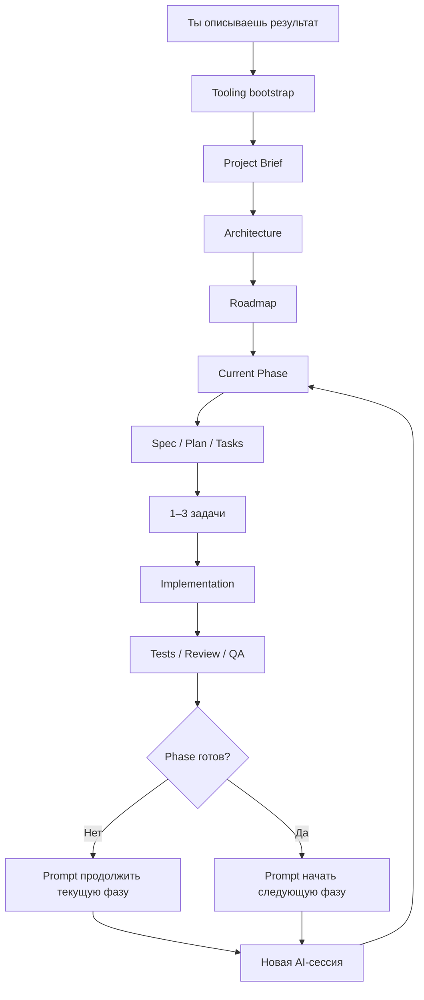

<div align="center">

# Token-Efficient Spec Kit

### Универсальный workflow для разработки с AI-агентами

**Ты описываешь результат. AI-агент сам выбирает стек, проектирует архитектуру, ведёт проект по фазам и в конце каждой сессии говорит тебе, что делать дальше.**

`Идея → Спеки → Архитектура → Фазы → Код → Проверка → Следующий prompt`

[English](README_EN.md) · [Руководство](docs/USAGE_GUIDE.md) · [Workflow](docs/WORKFLOW.md) · [Интеграции](integrations/README.md)

</div>

---

## Зачем это нужно

При работе с AI coding agents быстро появляется две проблемы:

1. агент начинает перечитывать слишком много контекста и тратить токены;
2. человеку без опыта разработки непонятно, **что просить у AI дальше**.

Token-Efficient Spec Kit решает обе.

> **Пользователь отвечает за то, что хочет получить. Агент отвечает за инженерные решения и следующий шаг.**

Вместо:

```text
React или Vue?
PostgreSQL или MongoDB?
REST или GraphQL?
Как разбить проект?
Что теперь делать?
```

ты можешь написать:

```text
Хочу приложение, где дизайнеры смогут продавать digital assets.
```

Дальше агент сам:

- понимает продукт и пользователей;
- уточняет только реальные blockers;
- выбирает рекомендуемый stack;
- проектирует architecture и data model;
- создаёт roadmap и phases;
- реализует работу маленькими проверяемыми batches;
- запускает tests / reviews / QA;
- определяет следующий шаг;
- выдаёт готовый prompt для новой AI-сессии.

---

# Быстрый старт

### 1. Клонируй repository

```bash
git clone https://github.com/Elguajo/Token-Efficient-Spec-Kit.git my-project
cd my-project
```

### 2. Открой проект в repository-aware AI coding agent

Например Codex, Claude Code, Cursor или другом совместимом coding harness.

### 3. Запусти

```text
prompts/START_NEW_PROJECT.md
```

Замени только:

```text
<WHAT_I_WANT>
```

Например:

```text
Хочу desktop-приложение для Windows и macOS,
которое сортирует мои 3D-ассеты,
создаёт previews и позволяет искать их по тегам.
```

**Всё остальное агент должен организовать сам.**

---

## Что произойдёт автоматически



Агент хранит project knowledge в repository, поэтому новую сессию не нужно начинать с пересказа всей истории.

---

# Самая важная идея: AI сам говорит, что делать дальше

Проект делится на **phases**.

В конце каждой meaningful coding/review session агент обязан определить состояние:

```text
IN PROGRESS
PHASE COMPLETE
PROJECT COMPLETE
```

После этого он создаёт:

```text
NEXT SESSION PROMPT
```

который можно **просто скопировать и вставить в новую AI-сессию**.

### Если фаза ещё не закончена

Следующий prompt продолжит текущую фазу и укажет следующие 1–3 задачи.

### Если фаза закончена

AI сам посмотрит `ROADMAP.md`, определит следующий этап и подготовит prompt для его старта.

### Если весь проект закончен

AI направит тебя в final audit / release / deployment либо предложит использовать `CHANGE_REQUEST` для новой функции.

Кроме ответа в чате, текущий handoff сохраняется в:

```text
docs/project/NEXT_SESSION.md
```

То есть в любой момент можно открыть этот файл и получить ответ на вопрос:

> **«Что мне делать дальше?»**

Если по какой-то причине handoff не был создан, есть fallback:

```text
prompts/GENERATE_NEXT_SESSION_PROMPT.md
```

Подробнее: [Session Handoff Protocol](docs/system/SESSION_HANDOFF.md)

---

## Почему это экономит токены

Обычная coding-сессия читает только минимальный контекст:

```text
Constitution
+ Project Brief
+ Architecture
+ Engineering Rules
+ Current Phase
+ Relevant ADR
+ Relevant code/tests
```

И **не перечитывает по умолчанию**:

```text
все завершённые phases
все ADR
всю историю чатов
гигантские master specs
повторяющиеся research dumps
```

Главный принцип:

> **Один факт — одно canonical место. Одна сессия — обычно 1–3 связанные задачи.**

---

# Senior autonomy

AI-agent должен самостоятельно принимать обычные engineering decisions.

Он не должен спрашивать тебя:

```text
React или Vue?
Postgres или MongoDB?
Vercel или AWS?
REST или GraphQL?
```

если ответ можно профессионально определить из требований проекта.

Вопрос нужен только когда неизвестный параметр реально меняет:

- сам продукт;
- стоимость;
- security;
- compliance;
- business rules;
- необратимое действие.

Во всех остальных случаях агент выбирает **один рекомендуемый вариант** и продолжает работу.

---

## Creative autonomy

Агенту разрешено проявлять инициативу там, где детали не зафиксированы.

Он может самостоятельно улучшать:

- UX flows;
- information architecture;
- feature organization;
- API ergonomics;
- data models;
- onboarding;
- loading / empty / error states;
- developer experience;
- небольшие high-value product ideas.

Но он не имеет права незаметно менять явные требования пользователя.

---

# Recommended AI Engineering Profile

Для production-oriented проектов default profile:

```text
Token-Efficient Spec Kit
├── GitHub Spec Kit
├── Superpowers
├── Superpowers Implementation Bridge
├── gstack
└── Context7
```

Инструменты не должны конкурировать друг с другом.

| Инструмент | Ответственность |
|---|---|
| **Token-Efficient Spec Kit** | Intent, architecture, phases, context discipline, handoff |
| **GitHub Spec Kit** | **WHAT** — specification, plan, tasks, convergence |
| **Superpowers** | **HOW** — TDD, implementation, systematic debugging |
| **Superpowers Bridge** | Не даёт Spec Kit и Superpowers дублировать planning |
| **gstack** | Engineering/design review, browser QA, release checks |
| **Context7** | Свежая документация libraries/API по необходимости |

`START_NEW_PROJECT.md` проверяет tooling state и запускает setup автоматически, если Recommended profile ещё не настроен.

Подробнее: [integrations/README.md](integrations/README.md)

---

## Процесс адаптируется под размер проекта

### S — Small

```text
Brief → Plan → Tasks → Implement → Verify
```

Для landing pages, небольших CLI, automations и маленьких features.

### M — Medium

```text
Brief → Architecture → Roadmap → Phase Specs → Implement → Converge
```

Для SaaS MVP, ecommerce, plugin + backend, internal tools.

### L — Large / High-risk

```text
Brief
→ Architecture
→ Risk model
→ Roadmap
→ Small specs
→ Selective quality gates
→ Implementation batches
→ Converge
```

Для marketplaces, payments, multi-role systems, sensitive data и critical migrations.

**High Risk означает больше проверок, а не автоматически более сложную архитектуру.**

---

# Как работать каждый день

Тебе достаточно знать несколько entry points:

| Ситуация | Что использовать |
|---|---|
| Начинаю новый проект | [`START_NEW_PROJECT.md`](prompts/START_NEW_PROJECT.md) |
| Хочу продолжить текущую работу | [`CONTINUE_PROJECT.md`](prompts/CONTINUE_PROJECT.md) |
| Хочу проверить и закрыть phase | [`REVIEW_CURRENT_PHASE.md`](prompts/REVIEW_CURRENT_PHASE.md) |
| Не понимаю, что делать дальше | [`GENERATE_NEXT_SESSION_PROMPT.md`](prompts/GENERATE_NEXT_SESSION_PROMPT.md) |
| Хочу изменить требования | [`CHANGE_REQUEST.md`](prompts/CHANGE_REQUEST.md) |
| Нужно исправить bug | [`BUG_FIX.md`](prompts/BUG_FIX.md) |

Но в нормальном процессе даже это упрощается:

```text
Session 1
   ↓
AI делает работу
   ↓
AI выдаёт NEXT SESSION PROMPT
   ↓
ты открываешь новую сессию
   ↓
вставляешь prompt
   ↓
Session 2
```

И так до завершения проекта.

---

## Quality gates

Код не считается готовым только потому, что агент его написал.

В зависимости от проекта используются:

```text
lint
+ typecheck
+ tests
+ build
+ security negative tests
+ browser/e2e QA
+ acceptance criteria
```

Для auth, payments, private files, permissions, webhooks и destructive migrations negative tests обязательны там, где они релевантны.

---

## Структура repository

```text
.
├── .specify/memory/
│   └── constitution.md
│
├── docs/
│   ├── project/
│   │   ├── PROJECT_BRIEF.md
│   │   ├── ARCHITECTURE.md
│   │   ├── ROADMAP.md
│   │   ├── TOOLING_STATUS.md
│   │   └── NEXT_SESSION.md
│   │
│   ├── phases/
│   ├── decisions/
│   ├── system/
│   ├── USAGE_GUIDE.md
│   └── WORKFLOW.md
│
├── integrations/
├── templates/
├── prompts/
├── AGENTS.md
├── README.md
└── README_EN.md
```

---

## Документация

- **Хочу просто начать:** [README.md](README.md)
- **Хочу понять, как пользоваться:** [docs/USAGE_GUIDE.md](docs/USAGE_GUIDE.md)
- **Хочу понять внутренний workflow:** [docs/WORKFLOW.md](docs/WORKFLOW.md)
- **Хочу понять переход между сессиями:** [docs/system/SESSION_HANDOFF.md](docs/system/SESSION_HANDOFF.md)
- **Хочу узнать, что делать дальше прямо сейчас:** [docs/project/NEXT_SESSION.md](docs/project/NEXT_SESSION.md)
- **Хочу понять integrations:** [integrations/README.md](integrations/README.md)

---

<div align="center">

### Опиши результат. Остальное — инженерная работа агента.

**[Начать новый проект →](prompts/START_NEW_PROJECT.md)**

<br />

Built with ♥ by [Elguajo](https://github.com/Elguajo)

</div>
