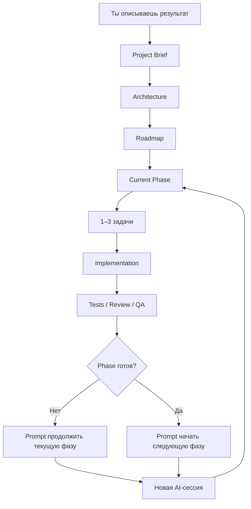

<div align="center">

# Token-Efficient Spec Kit

### Универсальный workflow для разработки с AI-агентами

**Ты описываешь результат. AI сам выбирает стек, проектирует архитектуру, ведёт проект по фазам, проверяет качество и в конце каждой сессии говорит, что делать дальше.**

`Идея → Архитектура → Фазы → 1–3 задачи → Код → Проверка → Следующий prompt`

**Current version: `0.5.0`**

[English](README_EN.md) · [Руководство](docs/USAGE_GUIDE.md) · [Workflow](docs/WORKFLOW.md) · [Интеграции](integrations/README.md) · [Changelog](CHANGELOG.md)

</div>

---

## Что это

**Token-Efficient Spec Kit — самостоятельный AI Engineering Workflow.**

Он не требует, чтобы пользователь разбирался в разработке или заранее выбирал framework, database, hosting, auth и другие технические детали.

Ты можешь написать:

```text
Хочу приложение, где дизайнеры смогут продавать digital assets.
```

Дальше AI самостоятельно:

1. понимает продукт и пользователей;
2. задаёт только действительно необходимые вопросы;
3. выбирает один рекомендуемый стек;
4. проектирует архитектуру и data model;
5. создаёт roadmap и phases;
6. берёт только 1–3 связанные задачи за сессию;
7. пишет код и tests;
8. запускает review / QA по необходимости;
9. проверяет acceptance criteria;
10. определяет следующий шаг;
11. выдаёт готовый prompt для новой AI-сессии.

> **Пользователь отвечает за желаемый результат. AI отвечает за инженерные решения и навигацию по проекту.**

---

# Быстрый старт

### 1. Клонируй repository

```bash
git clone https://github.com/Elguajo/Token-Efficient-Spec-Kit.git my-project
cd my-project
```

### 2. Открой его в repository-aware AI coding agent

Например Codex, Claude Code, Cursor или другом совместимом coding harness.

### 3. Запусти

```text
prompts/START_NEW_PROJECT.md
```

Замени только:

```text
<WHAT_I_WANT>
```

Например:

```text
Хочу desktop-приложение для Windows и macOS,
которое сортирует мои 3D-ассеты,
создаёт previews и позволяет искать их по тегам.
```

**После этого workflow должен вести проект сам.**

---

## Как проходит работа



Project knowledge хранится в repository, а не только в истории чата.

---

# Главная особенность — AI сам говорит, что делать дальше

В конце каждой meaningful coding/review session AI обязан определить:

```text
IN PROGRESS
PHASE COMPLETE
PROJECT COMPLETE
```

После этого он создаёт **NEXT SESSION PROMPT**.

Ты просто:

```text
получил prompt
→ открыл новую сессию
→ вставил prompt
→ продолжил работу
```

Не нужно самому понимать:

```text
какой phase следующий?
пора ли тестировать?
что осталось?
нужен ли review?
что написать AI завтра?
```

Текущий handoff также хранится в:

```text
docs/project/NEXT_SESSION.md
```

Если handoff потерялся:

```text
prompts/GENERATE_NEXT_SESSION_PROMPT.md
```

Подробнее: [Session Handoff Protocol](docs/system/SESSION_HANDOFF.md)

---

## Почему это экономит токены

Обычная сессия читает только:

```text
Constitution
+ Project Brief
+ Architecture
+ Engineering Rules
+ Current Phase
+ relevant ADR
+ relevant code/tests
```

Она **не перечитывает по умолчанию**:

```text
все завершённые phases
все ADR
всю историю чатов
гигантские master specs
повторяющиеся research dumps
```

> **Один факт — одно canonical место. Одна сессия — обычно 1–3 связанные задачи.**

---

# Senior autonomy

AI не должен перекладывать обычные engineering decisions на пользователя.

Он не должен спрашивать:

```text
React или Vue?
Postgres или MongoDB?
Vercel или AWS?
REST или GraphQL?
```

если это можно профессионально определить из требований.

Вопрос пользователю нужен только когда неизвестный параметр реально меняет продукт, стоимость, security, compliance, business rules или требует необратимого действия.

---

## Creative autonomy

AI может самостоятельно улучшать незаданные детали:

- UX flows;
- information architecture;
- feature organization;
- API ergonomics;
- data models;
- onboarding;
- loading / empty / error states;
- developer experience;
- небольшие high-value product ideas.

Но он не имеет права незаметно менять явные требования пользователя.

---

# Recommended AI Engineering Profile

Наш workflow является core сам по себе.

Default:

```text
Token-Efficient Spec Kit
├── Superpowers
├── gstack
└── Context7
```

| Инструмент | Роль |
|---|---|
| **Token-Efficient Spec Kit** | **CORE** — intent, architecture, roadmap, phases, tasks, context, convergence, handoff |
| **Superpowers** | **HOW** — TDD, implementation discipline, systematic debugging |
| **gstack** | Challenge / review / browser QA / release checks |
| **Context7** | Свежая документация libraries/API по необходимости |

`START_NEW_PROJECT.md` автоматически проверяет tooling state и запускает default setup, если нужно.

Подробнее: [integrations/README.md](integrations/README.md)

---

# GitHub Spec Kit — optional Advanced Spec Mode

GitHub Spec Kit **не нужен для обычной работы**.

Наш workflow уже самостоятельно выполняет project-level:

```text
Brief
Architecture
Roadmap
Phases
Tasks
Acceptance Criteria
Convergence
Session Handoff
```

Но GitHub Spec Kit остаётся полезным для отдельных сложных фаз, например:

```text
Payments
Complex Authorization
Multi-tenancy
Public API contracts
Critical migrations
Large ambiguous integrations
```

Тогда:

```text
Token-Efficient Spec Kit
= project-level source of truth

GitHub Spec Kit
= optional deep specification inside current phase

Superpowers
= implementation discipline
```

Для включения:

```text
prompts/ENABLE_ADVANCED_SPEC_MODE.md
```

---

## Процесс адаптируется под проект

### S — Small

```text
Brief → Tasks → Implement → Verify
```

### M — Medium

```text
Brief → Architecture → Roadmap → Phases → Implement → Converge
```

### L / High-risk

```text
Brief
→ Architecture
→ Roadmap
→ Small phases
→ Stronger quality gates
→ optional Advanced Spec Mode where useful
→ Converge
```

High Risk означает больше доказательств качества, а не автоматически больше frameworks.

---

# Как работать каждый день

| Ситуация | Что использовать |
|---|---|
| Начинаю новый проект | [`START_NEW_PROJECT.md`](prompts/START_NEW_PROJECT.md) |
| Продолжаю работу | [`CONTINUE_PROJECT.md`](prompts/CONTINUE_PROJECT.md) |
| Проверяю/закрываю phase | [`REVIEW_CURRENT_PHASE.md`](prompts/REVIEW_CURRENT_PHASE.md) |
| Не знаю, что делать дальше | [`GENERATE_NEXT_SESSION_PROMPT.md`](prompts/GENERATE_NEXT_SESSION_PROMPT.md) |
| Меняю требования | [`CHANGE_REQUEST.md`](prompts/CHANGE_REQUEST.md) |
| Исправляю bug | [`BUG_FIX.md`](prompts/BUG_FIX.md) |
| Хочу понять состояние проекта | [`PROJECT_DOCTOR.md`](prompts/PROJECT_DOCTOR.md) |
| Проверяю сам workflow на противоречия | [`AUDIT_WORKFLOW.md`](prompts/AUDIT_WORKFLOW.md) |
| Обновляю workflow безопасно | [`UPDATE_WORKFLOW.md`](prompts/UPDATE_WORKFLOW.md) |

В нормальном процессе тебе чаще всего понадобится только:

```text
START_NEW_PROJECT
↓
NEXT SESSION PROMPT
↓
NEXT SESSION PROMPT
↓
NEXT SESSION PROMPT
↓
PROJECT COMPLETE
```

---

# Project Doctor — «что происходит с проектом?»

Если ты не понимаешь текущее состояние repository, запусти:

```text
prompts/PROJECT_DOCTOR.md
```

Он не начинает новую разработку, а объясняет человеческим языком:

```text
Health: HEALTHY / NEEDS ATTENTION / BLOCKED / UNKNOWN
Current phase
Что уже сделано
Что осталось
Какие проверки проходят или падают
Есть ли проблема с workflow/tooling
Что делать дальше
NEXT SESSION PROMPT
```

То есть это кнопка **«объясни мне состояние проекта и скажи следующий шаг»**.

Подробнее: [Project Doctor Protocol](docs/system/PROJECT_DOCTOR.md)

---

# Workflow Self-Audit

Сам framework тоже может со временем начать противоречить себе.

После значимых изменений запусти:

```text
prompts/AUDIT_WORKFLOW.md
```

Audit проверяет:

- согласованность Constitution / AGENTS / README / prompts;
- ownership инструментов;
- default vs optional tooling;
- Session Handoff;
- token efficiency;
- stale paths/links;
- safe update boundaries;
- VERSION / CHANGELOG consistency.

Audit **не переписывает framework автоматически** — он сначала показывает проблемы и минимальные рекомендуемые исправления.

Подробнее: [Workflow Self-Audit](docs/system/WORKFLOW_SELF_AUDIT.md)

---

# Безопасное обновление workflow

Проект может обновлять Token-Efficient Spec Kit до новой версии, не уничтожая реальные project docs.

Используй:

```text
prompts/UPDATE_WORKFLOW.md
```

Updater разделяет файлы на три класса:

```text
Framework-managed
→ system docs / prompts / integrations / templates

Merge-sensitive
→ Constitution / AGENTS.md

Project-owned
→ PROJECT_BRIEF / ARCHITECTURE / ROADMAP
→ phases / ADRs
→ source code / tests / migrations
```

**Project-owned файлы нельзя автоматически перезаписывать template defaults.**

После update автоматически требуется Workflow Self-Audit.

Подробнее: [Safe Workflow Update Policy](docs/system/WORKFLOW_UPDATE_POLICY.md)

---

# Версионирование

Текущая версия хранится в:

```text
VERSION
```

История изменений:

```text
CHANGELOG.md
```

Проект использует Semantic Versioning:

```text
MAJOR.MINOR.PATCH
```

- `PATCH` — исправления без изменения workflow contract;
- `MINOR` — новые совместимые capabilities;
- `MAJOR` — breaking изменения workflow/file contracts.

---

## Quality gates

Код не считается готовым только потому, что AI его написал.

В зависимости от проекта используются:

```text
lint
+ typecheck
+ tests
+ build
+ security negative tests
+ browser/e2e QA
+ acceptance criteria
```

---

## Документация

- **Просто начать:** [README.md](README.md)
- **Пошаговое руководство:** [docs/USAGE_GUIDE.md](docs/USAGE_GUIDE.md)
- **Как работает система внутри:** [docs/WORKFLOW.md](docs/WORKFLOW.md)
- **Что делать дальше:** [docs/project/NEXT_SESSION.md](docs/project/NEXT_SESSION.md)
- **Переход между сессиями:** [docs/system/SESSION_HANDOFF.md](docs/system/SESSION_HANDOFF.md)
- **Project Doctor:** [docs/system/PROJECT_DOCTOR.md](docs/system/PROJECT_DOCTOR.md)
- **Workflow Self-Audit:** [docs/system/WORKFLOW_SELF_AUDIT.md](docs/system/WORKFLOW_SELF_AUDIT.md)
- **Safe Updates:** [docs/system/WORKFLOW_UPDATE_POLICY.md](docs/system/WORKFLOW_UPDATE_POLICY.md)
- **Интеграции:** [integrations/README.md](integrations/README.md)
- **История версий:** [CHANGELOG.md](CHANGELOG.md)
- **Contributing:** [CONTRIBUTING.md](CONTRIBUTING.md)
- **Security:** [SECURITY.md](SECURITY.md)

---

<div align="center">

### Опиши результат. Остальное — инженерная работа агента.

**[Начать новый проект →](prompts/START_NEW_PROJECT.md)**

<br />

Built with ♥ by [Elguajo](https://github.com/Elguajo)

</div>
