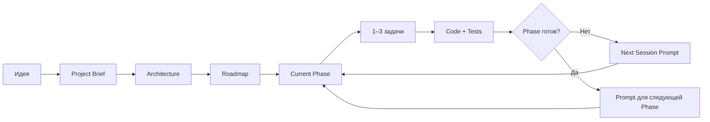

<div align="center">

# Token-Efficient Spec Kit

### Универсальный workflow для разработки с AI-агентами

**Ты описываешь, что хочешь получить. AI сам выбирает стек, проектирует архитектуру, ведёт проект по фазам и в конце каждой сессии говорит, что делать дальше.**

`Идея → Архитектура → Фазы → 1–3 задачи → Код → Проверка → Следующий prompt`

**v0.5.0**

[English](README_EN.md) · [Руководство](docs/USAGE_GUIDE.md) · [Workflow](docs/WORKFLOW.md) · [Maintenance](docs/MAINTENANCE.md) · [Changelog](CHANGELOG.md)

</div>

---

## Что это

**Token-Efficient Spec Kit — самостоятельный AI Engineering Workflow.**

Он создан для ситуации, когда ты понимаешь **что хочешь сделать**, но не обязан знать:

```text
какой framework выбрать
какая database лучше
как построить architecture
на какие phases разбить проект
что попросить у AI следующим сообщением
```

Например, ты пишешь:

```text
Хочу приложение, где дизайнеры смогут продавать digital assets.
```

AI должен самостоятельно:

- понять продукт и пользователей;
- спросить только то, без чего действительно нельзя продолжать;
- выбрать один рекомендуемый stack;
- создать Architecture и Roadmap;
- разделить работу на проверяемые phases;
- делать обычно по 1–3 связанные задачи за сессию;
- запускать нужные tests / review / QA;
- определить следующий инженерный шаг;
- выдать готовый prompt для новой AI-сессии.

> **Ты управляешь продуктом. AI управляет инженерным исполнением и навигацией по проекту.**

---

# Быстрый старт

### 1. Клонируй repository

```bash
git clone https://github.com/Elguajo/Token-Efficient-Spec-Kit.git my-project
cd my-project
```

### 2. Открой его в AI coding agent

Например Codex, Claude Code, Cursor или другом repository-aware agent.

### 3. Запусти

```text
prompts/START_NEW_PROJECT.md
```

Замени только:

```text
<WHAT_I_WANT>
```

Например:

```text
Хочу desktop-приложение для Windows и macOS,
которое сортирует мои 3D-ассеты,
создаёт previews и позволяет искать их по тегам.
```

**После этого workflow должен вести проект сам.**

---

## Как проходит работа



Project knowledge хранится в repository, поэтому новую сессию не нужно начинать с пересказа всей истории.

---

# AI сам говорит, что делать дальше

Это одна из главных особенностей workflow.

В конце meaningful coding/review session AI определяет:

```text
IN PROGRESS
PHASE COMPLETE
PROJECT COMPLETE
```

и обязательно создаёт:

```text
NEXT SESSION PROMPT
```

Ты просто копируешь его в новую сессию.

Текущий handoff также хранится в:

```text
docs/project/NEXT_SESSION.md
```

Если handoff потерялся:

```text
prompts/GENERATE_NEXT_SESSION_PROMPT.md
```

[Подробнее о Session Handoff →](docs/system/SESSION_HANDOFF.md)

---

## Почему это экономит токены

Обычная рабочая сессия читает только минимально нужный контекст:

```text
Constitution
+ Project Brief
+ Architecture
+ Current Phase
+ relevant ADR
+ relevant code/tests
```

Она не должна без необходимости перечитывать весь roadmap, все старые phases, всю историю чатов или огромные master specs.

> **Один факт — одно canonical место. Одна сессия — обычно 1–3 связанные задачи.**

---

## Recommended profile

Сам Token-Efficient Spec Kit является **core**.

Дополнительный рекомендуемый набор:

| Инструмент | Роль |
|---|---|
| **Superpowers** | TDD, implementation discipline, systematic debugging |
| **gstack** | Engineering/design review, browser QA, release checks |
| **Context7** | Свежая документация libraries/API по необходимости |

GitHub Spec Kit **не обязателен**. Он доступен как [Optional Advanced Spec Mode](integrations/SPEC_KIT.md) для сложных фаз, где formal deep specification действительно полезна.

[Подробнее об интеграциях →](integrations/README.md)

---

# Основные команды

| Ситуация | Что использовать |
|---|---|
| Начать новый проект | [`START_NEW_PROJECT.md`](prompts/START_NEW_PROJECT.md) |
| Продолжить работу | предыдущий **NEXT SESSION PROMPT** |
| Проверить/закрыть phase | [`REVIEW_CURRENT_PHASE.md`](prompts/REVIEW_CURRENT_PHASE.md) |
| Не понимаю, что происходит | [`PROJECT_DOCTOR.md`](prompts/PROJECT_DOCTOR.md) |
| Потерял следующий шаг | [`GENERATE_NEXT_SESSION_PROMPT.md`](prompts/GENERATE_NEXT_SESSION_PROMPT.md) |
| Изменить требования | [`CHANGE_REQUEST.md`](prompts/CHANGE_REQUEST.md) |
| Исправить bug | [`BUG_FIX.md`](prompts/BUG_FIX.md) |

В обычной работе цикл выглядит ещё проще:

```text
START_NEW_PROJECT
↓
NEXT SESSION PROMPT
↓
NEXT SESSION PROMPT
↓
NEXT SESSION PROMPT
↓
PROJECT COMPLETE
```

---

## Куда идти дальше

| Хочу понять... | Открыть |
|---|---|
| Как пользоваться системой пошагово | [Usage Guide](docs/USAGE_GUIDE.md) |
| Как workflow устроен внутри | [End-to-End Workflow](docs/WORKFLOW.md) |
| Что делать прямо сейчас в текущем проекте | [NEXT_SESSION.md](docs/project/NEXT_SESSION.md) |
| Как работают дополнительные инструменты | [Integrations](integrations/README.md) |
| Как использовать Doctor, Self-Audit, Updates и Versioning | [Maintenance](docs/MAINTENANCE.md) |
| Что изменилось между версиями | [Changelog](CHANGELOG.md) |
| Как предложить изменение | [Contributing](CONTRIBUTING.md) |

---

<div align="center">

### Опиши результат. Остальное — инженерная работа агента.

**[Начать новый проект →](prompts/START_NEW_PROJECT.md)**

<br />

Built with ♥ by [Elguajo](https://github.com/Elguajo)

</div>
