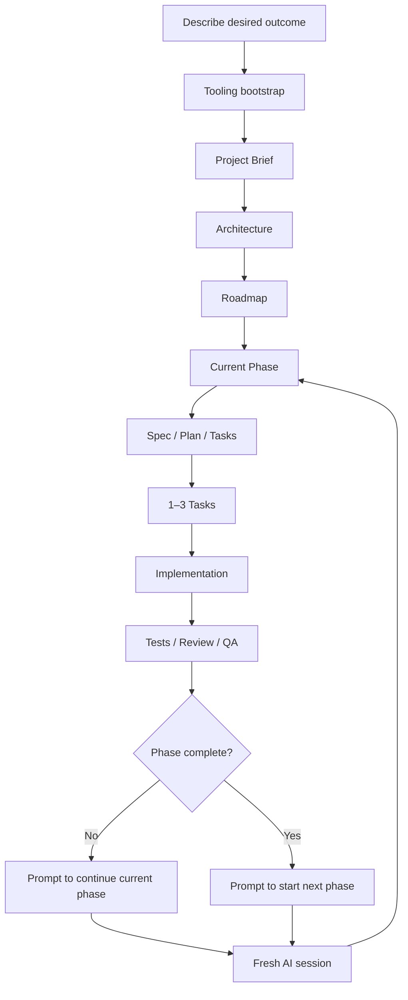

<div align="center">

# Token-Efficient Spec Kit

### A universal workflow for building software with AI coding agents

**You describe the outcome. The AI agent chooses the stack, designs the architecture, works phase by phase, and tells you exactly what to do next at the end of every session.**

`Idea → Specs → Architecture → Phases → Code → Verification → Next Prompt`

[Русская версия](README.md) · [Usage Guide](docs/USAGE_GUIDE.md) · [Workflow](docs/WORKFLOW.md) · [Integrations](integrations/README.md)

</div>

---

## Why this exists

AI coding agents create two common problems on longer projects:

1. they repeatedly load too much context and waste tokens;
2. non-developers often do not know **what to ask the AI to do next**.

Token-Efficient Spec Kit addresses both.

> **The user owns the desired outcome. The AI owns engineering decisions and the next step.**

Instead of choosing frameworks, databases, hosting, architecture, phase order, and the next engineering task yourself, you can simply say:

```text
I want a marketplace where designers can sell digital assets.
```

The agent should then:

- understand the product and users;
- ask only true blocking questions;
- choose one recommended stack;
- design architecture and data boundaries;
- classify complexity and risk;
- create a roadmap and verifiable phases;
- implement small batches of 1–3 cohesive tasks;
- run relevant tests/reviews/QA;
- determine the next engineering step;
- produce a ready-to-copy prompt for the next fresh AI session.

---

# Quick Start

### 1. Clone the repository

```bash
git clone https://github.com/Elguajo/Token-Efficient-Spec-Kit.git my-project
cd my-project
```

### 2. Open it in a repository-aware AI coding agent

For example Codex, Claude Code, Cursor, or another compatible coding harness.

### 3. Run

```text
prompts/START_NEW_PROJECT.md
```

Replace only:

```text
<WHAT_I_WANT>
```

with your desired outcome.

Example:

```text
I want a desktop app for Windows and macOS that organizes my 3D assets,
generates previews, and lets me search them by tags.
```

**The agent should organize the engineering work from there.**

---

## What happens automatically



Project knowledge lives in the repository, so a new session does not require retelling the whole project.

---

# The key idea: the AI tells you what to do next

At the end of every meaningful implementation/review session, the agent must classify the state as:

```text
IN PROGRESS
PHASE COMPLETE
PROJECT COMPLETE
```

Then it must:

1. decide the correct next engineering action;
2. update `docs/project/NEXT_SESSION.md`;
3. return a **NEXT SESSION PROMPT** that is ready to paste into a fresh AI session.

### If the phase is still in progress

The next prompt continues the same phase and identifies the next 1–3 tasks.

### If the phase is complete

The AI reads `ROADMAP.md`, identifies the next phase itself, and prepares the next-session prompt.

### If the project is complete

The AI routes the work into final audit, release, deployment, security/browser QA, or explains how to begin a future change request.

If a handoff is ever lost, use:

```text
prompts/GENERATE_NEXT_SESSION_PROMPT.md
```

Full protocol: [Session Handoff](docs/system/SESSION_HANDOFF.md)

---

## Why it saves tokens

A normal coding session should read only:

```text
Constitution
+ Project Brief
+ Architecture
+ Engineering Rules
+ Current Phase
+ Relevant ADR if needed
+ Relevant code/tests
```

It should not automatically reread:

```text
all completed phases
all ADRs
full chat history
giant master specs
raw research dumps
```

Core rule:

> **One fact, one canonical location. One session, usually 1–3 cohesive tasks.**

---

# Senior autonomy

The AI should make routine engineering decisions itself.

It should not ask you:

```text
React or Vue?
Postgres or MongoDB?
Vercel or AWS?
REST or GraphQL?
```

when those choices can be professionally derived from project requirements.

A user question is justified only when a missing answer materially changes:

- the product;
- cost;
- security;
- compliance;
- business rules;
- irreversible/destructive actions.

Otherwise the agent chooses one recommended default and proceeds.

---

## Creative autonomy

Where requirements are unspecified, the agent may improve:

- UX flows;
- information architecture;
- feature organization;
- API ergonomics;
- data models;
- onboarding;
- loading/empty/error states;
- developer experience;
- small high-value product ideas.

It must never silently override explicit user constraints.

---

# Recommended AI Engineering Profile

Default production-oriented profile:

```text
Token-Efficient Spec Kit
├── GitHub Spec Kit
├── Superpowers
├── Superpowers Implementation Bridge
├── gstack
└── Context7
```

| Tool | Responsibility |
|---|---|
| **Token-Efficient Spec Kit** | Intent, architecture discipline, phases, context budget, session handoff |
| **GitHub Spec Kit** | **WHAT** — specification, plan, tasks, convergence |
| **Superpowers** | **HOW** — implementation, TDD, systematic debugging |
| **Superpowers Bridge** | Prevents duplicate planning ownership |
| **gstack** | Engineering/design review, browser QA, release checks |
| **Context7** | Fresh library/API documentation on demand |

`START_NEW_PROJECT.md` checks tooling state and can bootstrap the Recommended profile when needed.

More: [integrations/README.md](integrations/README.md)

---

## Adaptive process

### S — Small

```text
Brief → Plan → Tasks → Implement → Verify
```

### M — Medium

```text
Brief → Architecture → Roadmap → Phase Specs → Implement → Converge → Handoff
```

### L / High-risk

```text
Brief
→ Architecture
→ Risk model
→ Roadmap
→ Small specs
→ Selective quality gates
→ Implementation batches
→ Converge
→ Handoff
```

High risk means more evidence and verification, not automatically more complex architecture.

---

# Daily use

| Situation | Use |
|---|---|
| Start a new project | [`START_NEW_PROJECT.md`](prompts/START_NEW_PROJECT.md) |
| Normal next session | **Paste the previous NEXT SESSION PROMPT** |
| Generic continuation fallback | [`CONTINUE_PROJECT.md`](prompts/CONTINUE_PROJECT.md) |
| Review/close current phase | [`REVIEW_CURRENT_PHASE.md`](prompts/REVIEW_CURRENT_PHASE.md) |
| Lost the handoff / unsure what is next | [`GENERATE_NEXT_SESSION_PROMPT.md`](prompts/GENERATE_NEXT_SESSION_PROMPT.md) |
| Requirements changed | [`CHANGE_REQUEST.md`](prompts/CHANGE_REQUEST.md) |
| Fix a bug | [`BUG_FIX.md`](prompts/BUG_FIX.md) |

Normal loop:

```text
Session 1
→ AI work
→ NEXT SESSION PROMPT
→ fresh session
→ paste prompt
→ Session 2
→ ...
```

---

## Quality gates

Depending on project type and risk:

```text
lint
+ typecheck
+ tests
+ build
+ security negative tests
+ browser/e2e QA
+ acceptance criteria
```

Auth, payments, permissions, private files, webhooks, and destructive migrations require stronger negative/security verification when relevant.

---

## Repository map

```text
.
├── .specify/memory/
│   └── constitution.md
├── docs/
│   ├── project/
│   │   ├── PROJECT_BRIEF.md
│   │   ├── ARCHITECTURE.md
│   │   ├── ROADMAP.md
│   │   ├── TOOLING_STATUS.md
│   │   └── NEXT_SESSION.md
│   ├── phases/
│   ├── decisions/
│   ├── system/
│   ├── USAGE_GUIDE.md
│   └── WORKFLOW.md
├── integrations/
├── templates/
├── prompts/
├── AGENTS.md
├── README.md
└── README_EN.md
```

---

## Documentation

- **Start here:** [README.md](README.md)
- **How to use it:** [docs/USAGE_GUIDE.md](docs/USAGE_GUIDE.md)
- **How the workflow works internally:** [docs/WORKFLOW.md](docs/WORKFLOW.md)
- **How sessions/phases hand off:** [docs/system/SESSION_HANDOFF.md](docs/system/SESSION_HANDOFF.md)
- **What should happen next right now:** [docs/project/NEXT_SESSION.md](docs/project/NEXT_SESSION.md)
- **Tool integrations:** [integrations/README.md](integrations/README.md)

---

<div align="center">

### Describe the outcome. Let the agent handle the engineering and the next step.

**[Start a new project →](prompts/START_NEW_PROJECT.md)**

<br />

Built with ♥ by [Elguajo](https://github.com/Elguajo)

</div>
